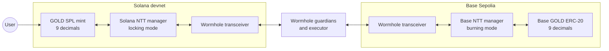
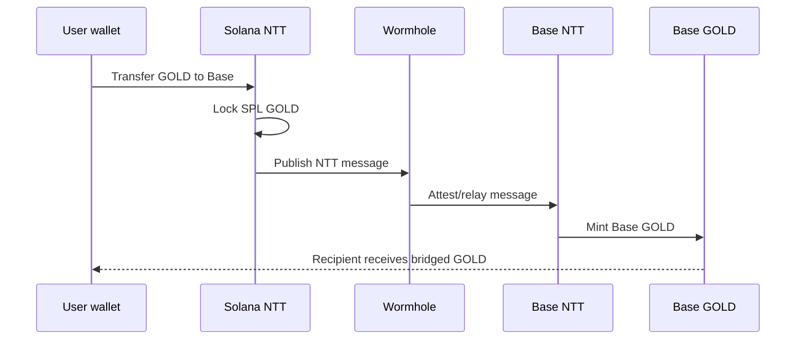
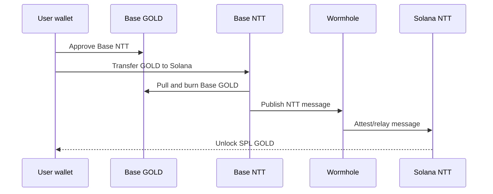

# GOLD bridge testnet runbook

This is the short path for proving Solana GOLD can bridge to Base with Wormhole NTT.

## Shape

Solana is canonical. Its NTT manager runs in locking mode. Base is the spoke chain. Its GOLD ERC-20 runs at 9 decimals and the Base NTT manager runs in burning mode.



## Commands

1. Fill `.env` from `.env.template`.
2. Install/check tools:

```bash
pnpm doctor
```

3. Deploy upgradeable Base GOLD and copy the printed proxy, implementation, timelock, and ProxyAdmin addresses into `.env`:

```bash
pnpm deploy:base-token
```

4. Initialize NTT and add both chains:

```bash
pnpm ntt:init
pnpm ntt:overrides
pnpm ntt:add-solana
pnpm ntt:add-base
```

5. Edit `deployment.json` rate limits, then push config and schedule minting handoff:

```bash
pnpm ntt:push
pnpm ntt:addresses
pnpm base:set-minter
pnpm timelock:execute
pnpm preflight
pnpm web:export-config
```

On testnet only, `TIMELOCK_EXECUTE_IMMEDIATELY=true pnpm base:set-minter` is acceptable when the timelock delay is zero.

6. Prove both directions:

```bash
TEST_TRANSFER_SOURCE_CHAIN=Solana \
TEST_TRANSFER_DESTINATION_CHAIN=BaseSepolia \
TEST_TRANSFER_AMOUNT=1 \
TEST_TRANSFER_DESTINATION_ADDRESS=<base-wallet> \
pnpm ntt:test-transfer

TEST_TRANSFER_SOURCE_CHAIN=BaseSepolia \
TEST_TRANSFER_DESTINATION_CHAIN=Solana \
TEST_TRANSFER_AMOUNT=0.5 \
TEST_TRANSFER_DESTINATION_ADDRESS=<solana-wallet> \
TEST_TRANSFER_DESTINATION_MSG_VALUE=10000000 \
pnpm ntt:test-transfer
```

## Transfer flow





## Testnet proof from this repo

- Solana GOLD mint: `6NLCfbAzMyykwjwifAZr8WRBTPsb8u5s1uAVvGBGGa4r`
- Solana NTT manager: `EQpZrkhQzc68x2qXV9imPstACEGEJJuXTQ8S2fAXpZva`
- Base GOLD token: `0x57A893ACE218ccCf6A0958b5354Aaad58777806F`
- Base NTT manager: `0x3df4e9Cd48B7c8290F80546547854ac8C82Dc276`

Proof txs:

- Solana -> Base: `5Q5kZFvU1W9yKdpG8GDqdr8sBeK5v9mmenjXZ8K9c3xj3f656QrW35XC9LkgAaUpPrRGurSu46dVbNsixc6WV8aA`
- Base -> Solana: `0xe2dd6ab8003134a3a0d8a5a4ba17b331600aa50b71ef0ae6e47dd98ddcf32c22`

## Gotchas

- Keep deployment artifacts and private keys out of git.
- `ntt new` refuses to scaffold inside an existing git repo, so use an ignored/external `NTT_PROJECT_DIR`.
- The Solana package pinned Solana CLI `1.18.26` and Anchor `0.29.0`.
- Base add-chain may need to continue without simulation on testnet even when `decimals()` works on-chain.
- Base -> Solana needs `TEST_TRANSFER_DESTINATION_MSG_VALUE` for executor rent/gas.
